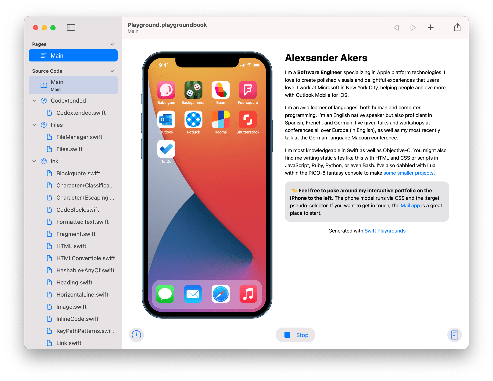

# Site Playground



This project repository is the result of the simple thought experiment: if John Sundell's [_Publish_][publish] static site generator is written in Swift, and Apple's Playgrounds apps for [iPad][playgrounds-ipad] and [macOS][playgrounds-mac] run Swift code, then surely there should be a way to run _Publish_ in the Playgrounds app.

The generated website itself is for my personal portfolio at [_a2.io_](https://a2.io) (which probably could have been written more simply in any of several other ways).

## Getting Started

As the Swift Playgrounds app (as of this writing, version 3.4.1) only supports Swift 5.3 and not the latest public release of Swift 5.4, certain modifications were made to John Sundell's _Publish_ library as documented in [_LICENSE.md_](LICENSE.md).

After cloning or otherwise downloading this repository, you can interact with the project in one of a few ways.

### Swift Package Manager

#### Xcode

1. Open [_Package.swift_](Package.swift) in Xcode.
2. Modify launch arguments as appropriate for your use case in the _Product_ > _Scheme_ > _Edit Scheme…_ menu.
3. You may also want to set the `OS_ACTIVITY_MODE=disable` environment variable to reduce system log noise.

#### Command Line

On macOS, you can run the following command:

```sh
swift run site [--export/-e <dest>] [--serve/-s [--open/-o] [--port/-p <port>]] [--verbose/-v]
```

### Command Line Arguments

Running the _site_ executable will always build the website. What happens next depends on the other flags that are set.

* `--export/-e <dest>` exports the website from the in-memory file manager to disk at the folder indicated by `dest`.
* `--serve/-s` serves the in-memory file system over HTTP.
  * `--open/-o` tells the program to open the _localhost_ URL in your configured default browser.
  * `--port/-p <port>` changes the port (default: 8000) to the `port` argument.
* `--verbose/-v` tells the program to output additional information to the console, for example incoming server HTTP request logs and generated file information.

### _Playground.playgroundbook_ in Swift Playgrounds

* Open the _Playground.playgroundbook_ file in [Swift Playgrounds for Mac][playgrounds-mac].
* Copy or share (e.g. via AirDrop) the _Playground.playgroundbook_ file to [Swift Playgrounds for iPad][playgrounds-ipad].

Then, tap the _Run My Code_ button to compile the project and build the site. A web view connected to the _localhost_ URL (at the default port, 8000) will be assigned to the Playground page's live view

## Local Resources

In order for the Playgrounds app to discover local resources, [`LocalResource`](Playground.playgroundbook/Contents/UserModules/UserModule.playgroundmodule/Sources/LocalResource.swift) is used as an intermediary to support resources in Xcode and the Playgrounds apps. `LocalResource.all` is an array computed property containing all local resources. Local files in the _Playground.playgroundbook/Contents/PublicResources_ directory are named in a GraphQL-esque fashion, where a triple underscore (`___`) instead of a sub-directory structure, because Playgrounds only supports a flat directory of resource files.

## Adding a new "App"

To add a new App, the [_App.swift_](Playground.playgroundbook/Contents/UserModules/UserModule.playgroundmodule/Sources/App.swift) file contains both the `App` protocol, the `DefaultApp` and `StubApp` structs and a computed array property on `A2.Website`. All apps are either `DefaultApp` or `StubApp` values, except for `MailApp` and `SafariApp`, which live in their own files. The required Sass/CSS lives in [_HTMLFactory.swift_](Playground.playgroundbook/Contents/UserModules/UserModule.playgroundmodule/Sources/HTMLFactory.swift) under `A2.HTMLFactory.makeStylesCSS(context:)`.

## Updating Dependencies

### Swift

It's inevitable that the [_Publish_][publish] library or one of its dependencies will be updated as Swift itself evolves. When that happens, you will want to clone the _Publish_ repository locally to the latest tagged version and check out its registered dependencies. The Swift files for those dependencies lives in _Playground.playgroundbook/Contents/UserModules/_. Each of the _Codextended_, _Files_, _Ink_, _Plot_, _Publish_, and _Sweep_ modules lives in a respective _\*.playgroundmodule_ folder. All source files in such a Playground module must be at the top level of that directory. This is important because, as of this writing, the source repositories of the _UserModules_ dependencies have a multi-level directory structure with _API_ and _Internal_ sub-directories.

### Sass / Dart

The _sass.dart.js_ file at _Playground.playgroundbook/Contents/PublicResources/sass.dart.js_ comes from the latest version (as of this writing, 1.25) of the [_dart-sass_](https://github.com/sass/dart-sass) Node.js module. If that file is updated, the respective Swift code in [_Sass.swift_](Playground.playgroundbook/Contents/UserModules/UserModule.playgroundmodule/Sources/Sass.swift) will need to be updated as well.

As _WebKit_ framework is available on both iPadOS and macOS, the Sass compiler wrapper uses a `WKWebView`  (outside of any view hierarchy) to execute the transpiled Dart source. (JavaScriptCore is unavailable in Playgrounds, so WebKit is used for its simpler JavaScript execution captabilities).

On Linux, where this site is compiled, the _WebKit_ framework is unavailable, and thus [`Foundation.Process`](https://developer.apple.com/documentation/foundation/process) is used to run Node.js.

## Website Inspiration


As a developer for iOS and Apple's other platform technologies, I thought about what it would look like if my website, which showcases my iOS work, itself looked like an iPhone. I drew the above sketch in the [IconFactory's Linea app](https://linea-app.com) on November 29, 2019. I started implementing what would become this Swift Playgrounds project in 2020, but got distracted by other work and side projects until May 2021 when I got Playgrounds to build _Publish_ sites. That's when I decided to combine my website prototype idea and my Swift Playgrounds work.

## License

Site Playground is available under the MIT license. See the [_LICENSE.md_](LICENSE.md) file for more information as well as third-party code used under license.

Apple and iPhone are trademarks of Apple Inc., registered in the U.S. and other countries and regions.

[playgrounds-ipad]: https://apps.apple.com/app/id908519492
[playgrounds-mac]: https://apps.apple.com/app/id1496833156
[publish]: https://github.com/JohnSundell/Publish
